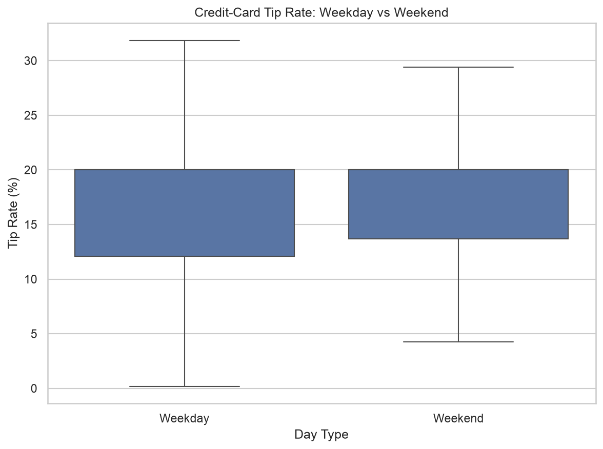

# NYC Yellow Taxi End-to-End 데이터 분석 보고서

## 1. 분석 데이터와 목적

- 데이터: NYC TLC Yellow Taxi Trip Records, 2026년 5월
- 원본 형식: Parquet
- 분석 목적 1: 평일과 주말의 카드 결제 팁 비율 평균 차이 검정
- 분석 목적 2: 운행 종료 시점의 정보로 팁 비율 20% 이상 여부 분류

`tip_amount`에는 현금 팁이 기록되지 않으므로 팁 분석과 모델 학습은
`payment_type == 1`인 카드 결제 운행으로 제한하였습니다.

고팁 목표값은 본 프로젝트에서 다음과 같이 정의하였습니다.

```text
팁 비율 = tip_amount / (total_amount - tip_amount)
high_tip = 팁 비율이 20% 이상이면 1, 아니면 0
```

## 2. Pandas와 Polars 로딩 비교

| library | rows | columns | missing_values | memory_mb | load_seconds |
| --- | --- | --- | --- | --- | --- |
| Pandas | 4090836 | 20 | 4776855 | 741.4847 | 0.5072 |
| Polars | 4090836 | 20 | 4776855 | 550.1264 | 0.2115 |

- 행 수 일치: **True**
- 열 수 일치: **True**
- 컬럼명 및 순서 일치: **True**
- 전체 결측치 수 일치: **True**
- 원본 파일 크기: **66.47 MB**
- Pandas 후속 분석 행 수: **4,090,836개**
- 표본 추출 기준: **전체 사용**

로딩 시간은 실행 환경, 디스크 속도, 캐시 상태에 따라 달라질 수 있으므로
이번 실행 환경에서의 참고값으로 해석하였습니다.

## 3. 데이터 정제

| rule | before_rows | removed_rows | after_rows |
| --- | --- | --- | --- |
| 완전 중복 행 제거 | 4090836 | 0 | 4090836 |
| 승차일시가 2026년 5월 범위 | 4090836 | 14 | 4090822 |
| 하차일시가 승차일시보다 늦음 | 4090822 | 52063 | 4038759 |
| 운행시간 1분 이상 180분 이하 | 4038759 | 42720 | 3996039 |
| 운행거리 0.1마일 이상 100마일 이하 | 3996039 | 102471 | 3893568 |
| 미터요금 0달러 초과 500달러 이하 | 3893568 | 13238 | 3880330 |
| 총 결제금액 0달러 초과 1000달러 이하 | 3880330 | 142 | 3880188 |
| 승차·하차 위치 ID가 1~265 범위 | 3880188 | 0 | 3880188 |
| 승객 수가 결측이거나 0~8명 범위 | 3880188 | 0 | 3880188 |
| 결제 유형이 결측이거나 0~6 범위 | 3880188 | 0 | 3880188 |

정제 범위는 완전 중복 제거, 2026년 5월 승차 기록 확인, 양수 운행시간,
현실적인 분석 범위의 운행시간·거리·요금, 유효한 위치 ID 등을 포함합니다.
이 범위는 TLC 공식 오류 판정 규칙이 아니라 본 프로젝트의 분석용 품질 규칙입니다.

### 결측치 처리 전

| variable | missing_count | missing_rate_percent |
| --- | --- | --- |
| passenger_count | 955371 | 23.3539 |
| RatecodeID | 955371 | 23.3539 |
| store_and_fwd_flag | 955371 | 23.3539 |
| congestion_surcharge | 955371 | 23.3539 |
| airport_fee | 955371 | 23.3539 |

### EDA용 결측치 처리 후

EDA용 결측치 처리 후 남은 결측치가 없습니다.

EDA용 데이터는 수치형 중앙값과 범주형 `Unknown`으로 처리하였습니다.
머신러닝에서는 전체 데이터에 미리 대체값을 적용하지 않고 Pipeline 내부에서
학습 데이터 기준으로 결측치를 처리하여 데이터 누수를 줄였습니다.

## 4. 기술통계

| variable | count | mean | std | min | 25% | 50% | 75% | max |
| --- | --- | --- | --- | --- | --- | --- | --- | --- |
| passenger_count | 3880188.0000 | 1.1872 | 0.5667 | 0.0000 | 1.0000 | 1.0000 | 1.0000 | 8.0000 |
| trip_distance | 3880188.0000 | 3.5429 | 4.2482 | 0.1000 | 1.1100 | 1.9500 | 3.9800 | 99.6600 |
| trip_duration_min | 3880188.0000 | 18.8608 | 15.4159 | 1.0000 | 8.9333 | 14.7000 | 23.4667 | 179.9833 |
| fare_amount | 3880188.0000 | 21.3834 | 17.1686 | 0.0100 | 10.0000 | 16.2400 | 26.2100 | 500.0000 |
| tip_amount | 3880188.0000 | 3.0215 | 3.9601 | 0.0000 | 0.0000 | 2.3600 | 4.1500 | 222.0000 |
| tolls_amount | 3880188.0000 | 0.5501 | 2.1874 | 0.0000 | 0.0000 | 0.0000 | 0.0000 | 145.6000 |
| total_amount | 3880188.0000 | 30.4717 | 21.3598 | 1.0100 | 17.7000 | 23.8800 | 34.7500 | 534.7100 |

- 평균은 데이터의 전체적인 중심을 보여줍니다.
- 표준편차는 평균 주변에서 값이 얼마나 퍼져 있는지 보여줍니다.
- 25%, 50%, 75% 분위수는 분포와 극단값을 확인하는 기준으로 사용하였습니다.

## 5. 카드 결제 데이터 상관계수

| variable | passenger_count | trip_distance | trip_duration_min | fare_amount | tolls_amount | pre_tip_amount | tip_amount | tip_rate_pct | pickup_hour |
| --- | --- | --- | --- | --- | --- | --- | --- | --- | --- |
| passenger_count | 1.0000 | 0.0201 | -0.0027 | 0.0375 | 0.0305 | 0.0431 | 0.0556 | 0.0272 | 0.0443 |
| trip_distance | 0.0201 | 1.0000 | 0.7837 | 0.9223 | 0.6216 | 0.9152 | 0.6108 | -0.1596 | -0.0273 |
| trip_duration_min | -0.0027 | 0.7837 | 1.0000 | 0.7991 | 0.4332 | 0.7677 | 0.4411 | -0.2425 | -0.0261 |
| fare_amount | 0.0375 | 0.9223 | 0.7991 | 1.0000 | 0.6191 | 0.9880 | 0.6961 | -0.1299 | -0.0148 |
| tolls_amount | 0.0305 | 0.6216 | 0.4332 | 0.6191 | 1.0000 | 0.7027 | 0.5302 | -0.0390 | -0.0159 |
| pre_tip_amount | 0.0431 | 0.9152 | 0.7677 | 0.9880 | 0.7027 | 1.0000 | 0.7340 | -0.0937 | 0.0090 |
| tip_amount | 0.0556 | 0.6108 | 0.4411 | 0.6961 | 0.5302 | 0.7340 | 1.0000 | 0.4807 | 0.0488 |
| tip_rate_pct | 0.0272 | -0.1596 | -0.2425 | -0.1299 | -0.0390 | -0.0937 | 0.4807 | 1.0000 | 0.0590 |
| pickup_hour | 0.0443 | -0.0273 | -0.0261 | -0.0148 | -0.0159 | 0.0090 | 0.0488 | 0.0590 | 1.0000 |

상관계수는 두 수치형 변수의 선형 관계를 나타냅니다. `total_amount`,
`tip_amount`, `pre_tip_amount`처럼 계산식으로 직접 연결된 변수는 구조적으로
높은 상관이 나타날 수 있으므로 인과관계로 해석하지 않았습니다.

## 6. 시각화

### Seaborn 정적 차트



평일과 주말 카드 결제 팁 비율의 분포를 비교합니다. 차트 가독성을 위해
50% 이하의 팁 비율만 표시하고 이상점 표시는 숨겼으며, t-test에는 정제 기준을
통과한 0~100% 팁 비율을 사용하였습니다.

### Plotly 인터랙티브 차트

[시간대별 평일·주말 운행 비중 차트 열기](outputs/plotly_hourly_trip_share.html)

평일과 주말의 표본 수 차이 영향을 줄이기 위해 단순 운행 건수가 아니라
각 그룹 내부의 시간대별 운행 비중을 비교하였습니다.

## 7. 독립표본 t-test

- 검정 방법: Welch independent two-sample t-test
- 귀무가설: 평일과 주말의 평균 카드 팁 비율은 같다.
- 대립가설: 평일과 주말의 평균 카드 팁 비율은 다르다.

| item | value |
| --- | --- |
| Weekday sample count | 100000.0000 |
| Weekend sample count | 100000.0000 |
| Weekday mean tip rate (%) | 16.7501 |
| Weekend mean tip rate (%) | 17.0096 |
| Mean difference (%p) | -0.2595 |
| t-statistic | -7.2578 |
| p-value | 0.0000 |
| Cohen's d | -0.0325 |

**p-value 해석:** p-value가 유의수준 0.05보다 작으므로 평일과 주말의 평균 카드 팁 비율이 같다는 귀무가설을 기각합니다. 다만 통계적 유의성과 실제 차이의 크기는 구분하여 해석해야 합니다.

p-value는 차이의 존재 여부를 판단하는 기준이고, 차이의 실제 크기를 의미하지는
않으므로 평균 차이와 Cohen's d를 함께 출력하였습니다.

## 8. 고팁 여부 ML Pipeline

### 목표값 분포

| high_tip | count | label | ratio_percent |
| --- | --- | --- | --- |
| 0 | 1517046 | Below 20% | 57.2161 |
| 1 | 1134384 | 20% or more | 42.7839 |

### Pipeline 구성

```text
날짜 컬럼에서 운행시간·승차시간·요일 파생변수 생성
    ↓
Pipeline 내부 수치형: 중앙값 대체 + StandardScaler
Pipeline 내부 범주형: Unknown 대체 + OneHotEncoder
    ↓
Pipeline 내부 LogisticRegression(class_weight='balanced')
```

`tip_amount`, `total_amount`, `tip_rate`, `high_tip`은 목표값과 직접 연결되므로
모델 입력에서 제외하여 데이터 누수를 방지하였습니다.

### 평가 결과

| metric | value |
| --- | --- |
| Baseline Accuracy | 0.5722 |
| Accuracy | 0.5594 |
| Precision | 0.4913 |
| Recall | 0.8406 |
| F1-score | 0.6201 |
| ROC-AUC | 0.6445 |

### 혼동행렬

| variable | Predicted Below 20% | Predicted 20% or more |
| --- | --- | --- |
| Actual Below 20% | 5993 | 11172 |
| Actual 20% or more | 2046 | 10789 |

### Classification Report

```text
              precision    recall  f1-score   support

   Below 20%     0.7455    0.3491    0.4756     17165
 20% or more     0.4913    0.8406    0.6201     12835

    accuracy                         0.5594     30000
   macro avg     0.6184    0.5949    0.5478     30000
weighted avg     0.6367    0.5594    0.5374     30000

```

## 9. 자동 생성 파일

- Pandas·Polars 비교: `outputs/loader_comparison.csv`
- 정제 단계 결과: `outputs/cleaning_summary.csv`
- 기술통계: `outputs/descriptive_statistics.csv`
- 상관계수: `outputs/correlation_matrix.csv`
- t-test 결과: `outputs/ttest_result.json`
- 모델 성능: `outputs/model_metrics.json`
- 저장 모델: `outputs/yellow_taxi_high_tip_pipeline.joblib`

## 10. 본인 의견 및 개선 사항

이번 분석에서는 대용량 Parquet 파일을 Pandas와 Polars로 각각 로딩하여
동일한 데이터가 읽혔는지 확인한 뒤, 메모리 부담이 큰 시각화와 ML 과정에는
고정 난수 표본을 사용하였습니다. 팁 분석에서는 현금 팁이 기록되지 않는 데이터
특성을 고려하여 카드 결제만 사용하였고, 모델에서는 목표값 계산에 사용한 컬럼을
제외하여 데이터 누수를 방지하였습니다.

개선 시에는 여러 달의 데이터를 연결한 뒤 시간 순서대로 학습·평가 데이터를
분리하고, 로지스틱 회귀 외에 트리 기반 모델과 성능을 비교할 수 있습니다.
또한 택시 존 이름과 날씨·행사 데이터를 결합하면 위치와 외부 환경에 따른
운행 수요 및 팁 패턴을 더 구체적으로 분석할 수 있습니다.

## 11. 분석 한계

- 원본 데이터는 사업자가 제출한 운행 기록이므로 기록 오류 가능성이 있습니다.
- 팁 분석은 현금 팁이 없는 것이 아니라 데이터에 기록되지 않는 문제 때문에 카드 결제로 제한했습니다.
- 기본 코드는 재현성과 실행 시간을 위해 전체 데이터을 사용합니다.
- 무작위 학습·평가 분리는 교육용 구성이며 실제 운영 모델은 시간 순서 분리가 더 적절할 수 있습니다.
