# NYC Yellow Taxi 2026년 5월 Question-Driven EDA 및 ML 보고서

## 1. 분석 목적과 범위

본 분석은 NYC Yellow Taxi 운행 데이터를 단순 요약하는 데서 끝내지 않고, 각 EDA 단계에서
**무엇을 확인했는지, 왜 그런 현상이 나타날 수 있는지, 머신러닝 전처리에 어떻게 반영할지**를
연결하는 것을 목적으로 합니다.

- 전체 데이터 규모: **4,090,836행 × 20열**
- 후속 EDA 규모: **500,000행**
- 표본 사용 여부: **예**
- 고팁 분류 목표: 결제 전 금액 대비 카드 팁 비율 **20% 이상**
- 분석 원칙: 큰 거리·긴 시간·큰 요금은 자동 삭제하지 않고 검토 플래그로 유지

전체 4,090,836행 중 재현 가능한 무작위 표본 500,000행을 후속 EDA에 사용했습니다.

> 표본 설정은 실행 가능성을 위한 것이며, Pandas·Polars의 행 수·열 수·결측치·중복 비교는
> 전체 Parquet 파일을 기준으로 수행합니다.

---

## 2. 실습 평가기준 충족 현황

| 평가 항목 | 구현 내용 |
| --- | --- |
| Pandas·Polars | 동일 Parquet 전체 로딩, 행·열·결측·중복·메모리·시간 비교 |
| 결측·중복·EDA | 컬럼 ML 프로파일, 결측 패턴, Vendor별 결측, 완전 중복 처리, 품질 플래그 |
| Seaborn | 분포·Boxplot·그룹 비교·상관관계·시간대·지역 차트 다수 생성 |
| Plotly | 요일×시간 Heatmap, 거리–요금 Scatter, 상위 승차 지역 인터랙티브 차트 |
| 기술통계 | 평균·중앙값·표준편차·분위수·왜도·첨도·0·음수 비율 산출 |
| 상관계수 | 모델 입력 가능 수치형 변수와 high_tip 상관관계 계산 |
| t-test | 평일·주말 팁 비율 Welch t-test, p-value·신뢰구간·Cohen's d 해석 |
| ML Pipeline | Imputer + StandardScaler + OneHotEncoder + LogisticRegression |
| 모델 평가·저장 | Accuracy·F1·ROC-AUC·PR-AUC·혼동행렬, joblib 저장 |
| 자동화 | 본 report.md와 presentation_5min.md 자동 생성 |

---

## 3. Pandas와 Polars 로딩 비교

| library | rows | columns | missing_values | duplicate_rows | memory_mb | load_time_seconds |
| --- | --- | --- | --- | --- | --- | --- |
| Polars | 4090836 | 20 | 4776855 | 0 | 550.1264 | 0.1345 |
| Pandas | 4090836 | 20 | 4776855 | 0 | 741.4847 | 6.6725 |

### Finding

- 두 라이브러리의 행 수 일치: **True**
- 두 라이브러리의 열 수 일치: **True**
- 컬럼 순서 일치: **True**
- 전체 결측치 수 일치: **True**

### Evidence

Pandas와 Polars 결과가 일치해야 이후 분석 차이가 라이브러리 로딩 오류가 아니라 분석 로직에서
발생한 것이라고 판단할 수 있습니다. 로딩 시간은 실행 환경, 디스크 캐시, 메모리 상태에 따라 달라지므로
한 번의 결과만으로 항상 어느 라이브러리가 빠르다고 일반화하지 않습니다.

### Possible Action

대용량 집계는 Polars Lazy 또는 DuckDB로 확장하고, 세밀한 시각화·sklearn 학습은 Pandas 표본을
사용하는 혼합 구조를 고려할 수 있습니다.

---

# Question-Driven EDA

## Question 1. 데이터는 어떤 구조이며 각 컬럼은 ML에서 어떤 역할인가?

### Finding

원본 컬럼을 단순히 dtype만으로 나누지 않고, 날짜·연속형·코드형 범주·Binary·목표값 생성 컬럼으로
구분했습니다. `VendorID`, `RatecodeID`, `PULocationID`, `DOLocationID`, `payment_type`은 숫자로 저장되어도
크기 관계가 없는 범주 코드입니다. `tip_amount`와 `total_amount`는 목표값 계산에 직접 사용되므로 모델 입력 시
데이터 누수 위험이 큽니다.

### Evidence

| ml_role | count |
| --- | --- |
| numeric | 10 |
| categorical_code | 5 |
| datetime | 2 |
| target_source | 2 |
| binary_categorical | 1 |

| column | dtype | ml_role | missing_rate_percent | unique_count_including_missing | unique_ratio | top_value | top_ratio_percent | recommended_preprocessing | leakage_risk |
| --- | --- | --- | --- | --- | --- | --- | --- | --- | --- |
| VendorID | int32 | categorical_code | 0.0000 | 4 | 0.0000 | 2 | 78.8468 | 문자열 범주로 변환 → Unknown 대체 → One-Hot Encoding | payment_type은 카드 전용 모델에서 상수이므로 제외 |
| tpep_pickup_datetime | datetime64[us] | datetime | 0.0000 | 444033 | 0.8881 | 2026-05-05 15:10:21 | 0.0010 | datetime 변환 후 시간·요일·운행시간 파생; 원시 시각은 필요에 따라 제외 | 낮음 |
| tpep_dropoff_datetime | datetime64[us] | datetime | 0.0000 | 444065 | 0.8881 | 2026-05-05 22:16:14 | 0.0010 | datetime 변환 후 시간·요일·운행시간 파생; 원시 시각은 필요에 따라 제외 | 낮음 |
| passenger_count | float64 | numeric | 23.3174 | 8 | 0.0000 | 1.0 | 63.0684 | 중앙값 대체(+결측 표시) → StandardScaler; 강한 왜도는 로그/Robust 처리 검토 | 낮음 |
| trip_distance | float64 | numeric | 0.0000 | 3244 | 0.0065 | 0.0 | 2.7722 | 중앙값 대체(+결측 표시) → StandardScaler; 강한 왜도는 로그/Robust 처리 검토 | 낮음 |
| RatecodeID | float64 | categorical_code | 23.3174 | 7 | 0.0000 | 1.0 | 69.4906 | 문자열 범주로 변환 → Unknown 대체 → One-Hot Encoding | payment_type은 카드 전용 모델에서 상수이므로 제외 |
| store_and_fwd_flag | object | binary_categorical | 23.3174 | 3 | 0.0000 | N | 76.5944 | Unknown 대체 후 One-Hot Encoding 또는 Y/N 이진 변환 | 낮음 |
| PULocationID | int32 | categorical_code | 0.0000 | 254 | 0.0005 | 237 | 4.8478 | 문자열 범주로 변환 → Unknown 대체 → One-Hot Encoding | payment_type은 카드 전용 모델에서 상수이므로 제외 |
| DOLocationID | int32 | categorical_code | 0.0000 | 259 | 0.0005 | 236 | 4.3810 | 문자열 범주로 변환 → Unknown 대체 → One-Hot Encoding | payment_type은 카드 전용 모델에서 상수이므로 제외 |
| payment_type | int64 | categorical_code | 0.0000 | 5 | 0.0000 | 1 | 66.7008 | 문자열 범주로 변환 → Unknown 대체 → One-Hot Encoding | payment_type은 카드 전용 모델에서 상수이므로 제외 |
| fare_amount | float64 | numeric | 0.0000 | 8185 | 0.0164 | 8.6 | 3.2568 | 중앙값 대체(+결측 표시) → StandardScaler; 강한 왜도는 로그/Robust 처리 검토 | 낮음 |
| extra | float64 | numeric | 0.0000 | 49 | 0.0001 | 0.0 | 57.3766 | 중앙값 대체(+결측 표시) → StandardScaler; 강한 왜도는 로그/Robust 처리 검토 | 낮음 |
| mta_tax | float64 | numeric | 0.0000 | 5 | 0.0000 | 0.5 | 98.3372 | 중앙값 대체(+결측 표시) → StandardScaler; 강한 왜도는 로그/Robust 처리 검토 | 낮음 |
| tip_amount | float64 | target_source | 0.0000 | 2959 | 0.0059 | 0.0 | 37.6842 | 목표값 생성에만 사용하고 모델 입력에서는 제외 | 매우 높음 |
| tolls_amount | float64 | numeric | 0.0000 | 341 | 0.0007 | 0.0 | 93.2320 | 중앙값 대체(+결측 표시) → StandardScaler; 강한 왜도는 로그/Robust 처리 검토 | 낮음 |
| improvement_surcharge | float64 | numeric | 0.0000 | 4 | 0.0000 | 1.0 | 95.9888 | 중앙값 대체(+결측 표시) → StandardScaler; 강한 왜도는 로그/Robust 처리 검토 | 낮음 |
| total_amount | float64 | target_source | 0.0000 | 12689 | 0.0254 | 17.7 | 0.5566 | 목표값 생성에만 사용하고 모델 입력에서는 제외 | 매우 높음 |
| congestion_surcharge | float64 | numeric | 23.3174 | 4 | 0.0000 | 2.5 | 67.8358 | 중앙값 대체(+결측 표시) → StandardScaler; 강한 왜도는 로그/Robust 처리 검토 | 낮음 |
| airport_fee | float64 | numeric | 23.3174 | 10 | 0.0000 | 0.0 | 70.3698 | 중앙값 대체(+결측 표시) → StandardScaler; 강한 왜도는 로그/Robust 처리 검토 | 낮음 |
| cbd_congestion_fee | float64 | numeric | 0.0000 | 3 | 0.0000 | 0.75 | 66.0432 | 중앙값 대체(+결측 표시) → StandardScaler; 강한 왜도는 로그/Robust 처리 검토 | 낮음 |

### Possible Action

- 날짜는 시간·요일·운행시간으로 파생합니다.
- 코드형 숫자는 문자열 범주로 바꾼 뒤 One-Hot Encoding합니다.
- 연속형은 중앙값 대체와 결측 표시, 스케일링을 적용합니다.
- 목표값 생성 컬럼은 학습 입력에서 제외합니다.
- 고유값 비율이 거의 1인 컬럼은 식별자 가능성을 검토하고 그대로 학습하지 않습니다.

---

## Question 2. 평균·중앙값·분위수는 어떤 분포 특성을 보여주는가?

### Finding

왜도가 큰 변수 상위 항목은 **average_speed_mph(419.9592), trip_distance(300.7082), fare_per_minute(71.3639), trip_duration_min(35.8274), fare_per_mile(25.2297)**입니다.
평균과 중앙값 차이가 크고 P99·최댓값 차이가 큰 변수는 오른쪽 꼬리가 길 가능성이 높습니다.
택시 거리·요금 자료에서는 실제 장거리 운행과 기록 오류가 함께 존재할 수 있으므로 최대값만으로 삭제하지 않습니다.

### Evidence

| variable | count | missing_count | missing_rate_percent | mean | median | std | min | p01 | q1 | q3 | p95 | p99 | p999 | max | skewness | kurtosis | zero_count | zero_rate_percent | negative_count | negative_rate_percent |
| --- | --- | --- | --- | --- | --- | --- | --- | --- | --- | --- | --- | --- | --- | --- | --- | --- | --- | --- | --- | --- |
| average_speed_mph | 493629 | 6371 | 1.2742 | 17.7071 | 8.8117 | 2374.4141 | 0.0000 | 0.0000 | 6.3158 | 12.2637 | 22.6184 | 32.9947 | 46.4698 | 1254685.9000 | 419.9592 | 196481.0540 | 13726 | 2.7806 | 0 | 0.0000 |
| trip_distance | 500000 | 0 | 0.0000 | 6.1193 | 1.8800 | 724.8034 | 0.0000 | 0.0000 | 1.0300 | 3.8200 | 12.4300 | 19.4600 | 30.2100 | 283971.7800 | 300.7082 | 97607.9532 | 13861 | 2.7722 | 0 | 0.0000 |
| fare_per_minute | 493629 | 6371 | 1.2742 | 4.7647 | 1.1257 | 72.5409 | -3000.0000 | 0.4522 | 0.9669 | 1.3761 | 2.1247 | 7.1448 | 1046.0088 | 21000.0000 | 71.3639 | 15212.4146 | 339 | 0.0687 | 1732 | 0.3509 |
| trip_duration_min | 500000 | 0 | 0.0000 | 18.7936 | 14.4667 | 25.7383 | 0.0000 | 0.0000 | 8.5833 | 23.3000 | 48.5333 | 79.4000 | 128.0167 | 2809.9500 | 35.8274 | 2076.6686 | 6371 | 1.2742 | 0 | 0.0000 |
| fare_per_mile | 486139 | 13861 | 2.7722 | 23.3531 | 7.6359 | 246.6311 | -7000.0000 | 2.9299 | 5.7780 | 10.0620 | 17.1053 | 47.0874 | 3888.4480 | 30000.0000 | 25.2297 | 1098.5485 | 269 | 0.0553 | 1547 | 0.3182 |
| tip_rate_pct | 499927 | 73 | 0.0146 | 11.6943 | 14.6359 | 12.3538 | -0.0000 | 0.0000 | 0.0000 | 20.0000 | 25.0079 | 30.0238 | 75.8326 | 1257.1429 | 15.7702 | 1055.8190 | 188348 | 37.6751 | 0 | 0.0000 |
| total_component_gap | 500000 | 0 | 0.0000 | 0.5770 | 0.0000 | 3.9206 | -46.7600 | -3.2500 | 0.0000 | 0.0000 | 4.5900 | 12.5001 | 51.0500 | 167.9600 | 9.6537 | 170.1270 | 278619 | 55.7238 | 89566 | 17.9132 |
| airport_fee | 383413 | 116587 | 23.3174 | 0.1655 | 0.0000 | 0.5902 | -2.0000 | 0.0000 | 0.0000 | 0.0000 | 2.0000 | 2.0000 | 2.0000 | 27.0000 | 5.7855 | 121.6988 | 351849 | 91.7676 | 267 | 0.0696 |
| tolls_amount | 500000 | 0 | 0.0000 | 0.5403 | 0.0000 | 2.1751 | -29.5800 | 0.0000 | 0.0000 | 0.0000 | 7.4600 | 7.4600 | 22.2500 | 77.0500 | 5.1975 | 45.5036 | 466160 | 93.2320 | 113 | 0.0226 |
| tip_amount | 500000 | 0 | 0.0000 | 2.9835 | 2.2500 | 4.0343 | -1.8600 | 0.0000 | 0.0000 | 4.1000 | 10.7300 | 17.7300 | 30.3000 | 100.0000 | 3.5946 | 33.3377 | 188421 | 37.6842 | 2 | 0.0004 |
| fare_amount | 500000 | 0 | 0.0000 | 21.5446 | 16.3000 | 18.2865 | -507.7000 | 3.7000 | 10.0000 | 26.8000 | 59.5000 | 82.1000 | 147.7002 | 650.0000 | 3.4966 | 44.3145 | 342 | 0.0684 | 1732 | 0.3464 |
| passenger_count | 383413 | 116587 | 23.3174 | 1.2435 | 1.0000 | 0.6371 | 0.0000 | 1.0000 | 1.0000 | 1.0000 | 2.0000 | 4.0000 | 6.0000 | 6.0000 | 3.1689 | 12.1993 | 1536 | 0.4006 | 0 | 0.0000 |
| pre_tip_amount | 500000 | 0 | 0.0000 | 27.5433 | 21.3500 | 20.2186 | -519.6600 | 8.0000 | 15.4500 | 32.2000 | 71.5000 | 90.9802 | 165.4400 | 665.9200 | 3.1478 | 33.2499 | 73 | 0.0146 | 1815 | 0.3630 |
| total_amount | 500000 | 0 | 0.0000 | 30.5268 | 23.9400 | 22.3912 | -519.6600 | 8.7000 | 17.6400 | 34.9500 | 79.5905 | 106.5300 | 183.1201 | 665.9200 | 3.1142 | 27.2052 | 73 | 0.0146 | 1815 | 0.3630 |
| extra | 500000 | 0 | 0.0000 | 1.1254 | 0.0000 | 1.7513 | -7.5000 | 0.0000 | 0.0000 | 2.5000 | 5.0000 | 7.0000 | 10.5000 | 15.2500 | 1.8519 | 4.1379 | 286883 | 57.3766 | 909 | 0.1818 |
| cbd_congestion_fee | 500000 | 0 | 0.0000 | 0.4935 | 0.7500 | 0.3595 | -0.7500 | 0.0000 | 0.0000 | 0.7500 | 0.7500 | 0.7500 | 0.7500 | 0.7500 | -0.7308 | -1.2921 | 168601 | 33.7202 | 1183 | 0.2366 |
| congestion_surcharge | 383413 | 116587 | 23.3174 | 2.2020 | 2.5000 | 0.8389 | -2.5000 | 0.0000 | 2.5000 | 2.5000 | 2.5000 | 2.5000 | 2.5000 | 2.5000 | -2.6493 | 6.0732 | 42772 | 11.1556 | 1462 | 0.3813 |
| improvement_surcharge | 500000 | 0 | 0.0000 | 0.9569 | 1.0000 | 0.2192 | -1.0000 | 0.0000 | 1.0000 | 1.0000 | 1.0000 | 1.0000 | 1.0000 | 1.0000 | -5.4697 | 32.4136 | 17393 | 3.4786 | 1780 | 0.3560 |
| mta_tax | 500000 | 0 | 0.0000 | 0.4900 | 0.5000 | 0.0819 | -0.5000 | 0.0000 | 0.5000 | 0.5000 | 0.5000 | 0.5000 | 0.5000 | 4.7500 | -8.1812 | 116.3124 | 6608 | 1.3216 | 1702 | 0.3404 |

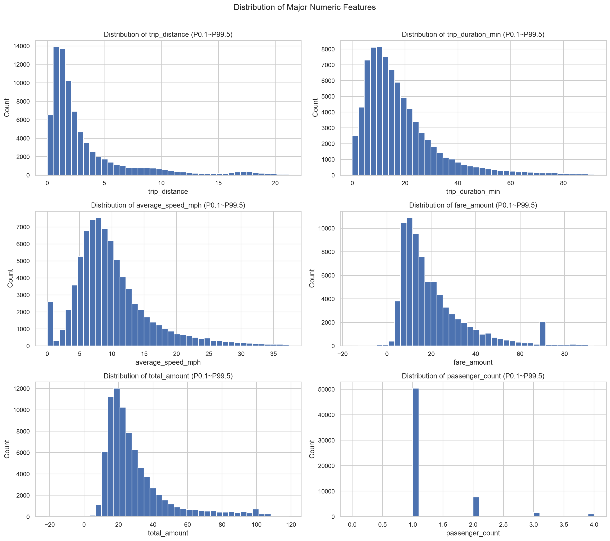

### Possible Action

- 선형 모델에서는 강한 왜도 변수에 `log1p`, RobustScaler, 구간화 등을 비교합니다.
- 트리 모델은 스케일에 덜 민감하지만 극단값 오류 여부는 여전히 검증해야 합니다.
- 평균만 보고 대표값을 판단하지 않고 중앙값·P95·P99를 함께 봅니다.

---

## Question 3. 결측치는 어디에 있으며 단순 누락인가?

### Finding

결측 비율이 높은 컬럼은 **store_and_fwd_flag(23.3174), airport_fee(23.3174), passenger_count(23.3174), RatecodeID(23.3174), congestion_surcharge(23.3174)**입니다.
결측이 Vendor별로 다르게 나타난다면 완전 무작위 결측이 아니라 수집 시스템 또는 사업자 차이와 연결될 수 있습니다.

### Evidence

| column | missing_count | missing_rate_percent | ml_role | recommended_preprocessing | ml_note |
| --- | --- | --- | --- | --- | --- |
| store_and_fwd_flag | 116587 | 23.3174 | binary_categorical | Unknown 대체 후 One-Hot Encoding 또는 Y/N 이진 변환 | Y/N 외 값과 결측치를 별도로 확인 |
| airport_fee | 116587 | 23.3174 | numeric | 중앙값 대체(+결측 표시) → StandardScaler; 강한 왜도는 로그/Robust 처리 검토 | 0·음수·극단값은 도메인 의미를 확인한 뒤 처리 |
| passenger_count | 116587 | 23.3174 | numeric | 중앙값 대체(+결측 표시) → StandardScaler; 강한 왜도는 로그/Robust 처리 검토 | 0·음수·극단값은 도메인 의미를 확인한 뒤 처리 |
| RatecodeID | 116587 | 23.3174 | categorical_code | 문자열 범주로 변환 → Unknown 대체 → One-Hot Encoding | 숫자 크기와 순서에 의미가 없는 코드형 변수 |
| congestion_surcharge | 116587 | 23.3174 | numeric | 중앙값 대체(+결측 표시) → StandardScaler; 강한 왜도는 로그/Robust 처리 검토 | 0·음수·극단값은 도메인 의미를 확인한 뒤 처리 |

#### 상위 동시 결측 패턴

| missing_columns | count | ratio_percent | store_and_fwd_flag | airport_fee | passenger_count | RatecodeID | congestion_surcharge |
| --- | --- | --- | --- | --- | --- | --- | --- |
| 결측 없음 | 383413 | 76.6826 | False | False | False | False | False |
| store_and_fwd_flag, airport_fee, passenger_count, RatecodeID, congestion_surcharge | 116587 | 23.3174 | True | True | True | True | True |

#### Vendor별 결측률

| VendorID | row_count | passenger_count_missing_count | passenger_count_missing_rate_percent | RatecodeID_missing_count | RatecodeID_missing_rate_percent | store_and_fwd_flag_missing_count | store_and_fwd_flag_missing_rate_percent | airport_fee_missing_count | airport_fee_missing_rate_percent | cbd_congestion_fee_missing_count | cbd_congestion_fee_missing_rate_percent |
| --- | --- | --- | --- | --- | --- | --- | --- | --- | --- | --- | --- |
| 2 | 394234 | 100648 | 25.5300 | 100648 | 25.5300 | 100648 | 25.5300 | 100648 | 25.5300 | 0 | 0.0000 |
| 1 | 98511 | 15012 | 15.2389 | 15012 | 15.2389 | 15012 | 15.2389 | 15012 | 15.2389 | 0 | 0.0000 |
| 7 | 6328 | 0 | 0.0000 | 0 | 0.0000 | 0 | 0.0000 | 0 | 0.0000 | 0 | 0.0000 |
| 6 | 927 | 927 | 100.0000 | 927 | 100.0000 | 927 | 100.0000 | 927 | 100.0000 | 0 | 0.0000 |

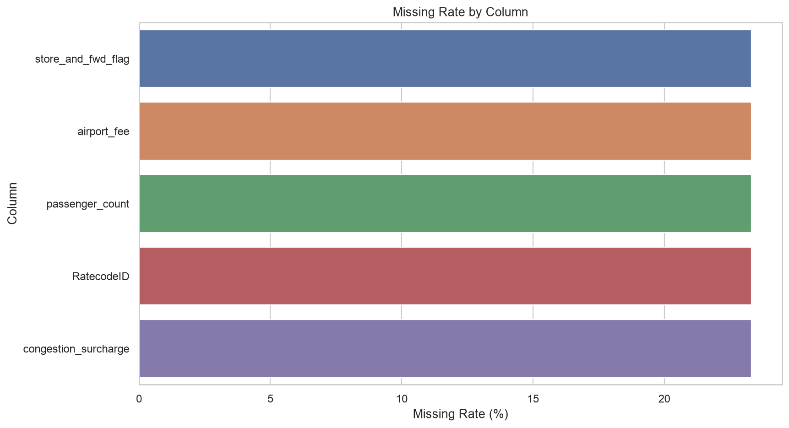

### Possible Action

- 수치형: Pipeline에서 중앙값 대체와 `add_indicator=True`로 결측 여부를 보존합니다.
- 범주형: 최빈값으로 특정 사업자·지역을 임의 생성하지 않고 `Unknown` 범주를 사용합니다.
- 목표값 생성에 필요한 `tip_amount`, `total_amount` 결측은 가짜 정답을 만들 수 있으므로 대체하지 않습니다.
- 결측 여부별 고팁률이 다르면 결측 자체가 예측 신호일 수 있으므로 표시 변수를 유지합니다.

#### 결측 여부와 Target 관계

표시할 결과가 없습니다.

---

## Question 4. Target인 팁 비율과 high_tip은 어떤 분포인가?

### Finding

카드 결제 중 목표값을 계산할 수 있는 행은 **333,464개**이며, 고팁 행은
**142,831개(42.83%)**입니다. 클래스 비율이 한쪽으로 치우치면 Accuracy만으로
모델을 평가할 수 없으므로 F1, Recall, Balanced Accuracy, ROC-AUC, Average Precision을 함께 봅니다.

### Evidence

| high_tip | count | label | ratio_percent |
| --- | --- | --- | --- |
| 0 | 190633 | Below 20% | 57.1675 |
| 1 | 142831 | 20% or more | 42.8325 |

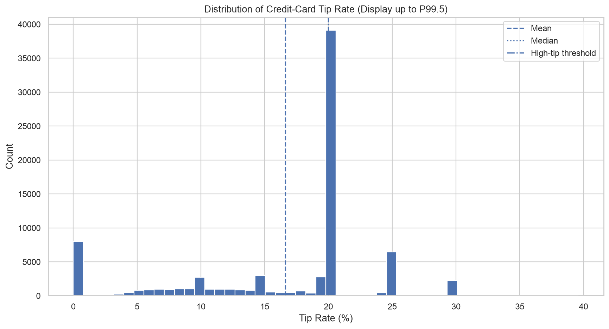

### Possible Action

- `class_weight='balanced'`를 사용해 소수 클래스 오류에 더 큰 가중치를 줍니다.
- 팁 비율 100% 초과 값도 자동 삭제하지 않고 별도 건수와 원인을 확인합니다.
- 목표 임계값 20%는 프로젝트 정의이므로 서비스 목적에 따라 15%·25% 등으로 민감도 분석할 수 있습니다.

---

## Question 5. 수치형 변수 중 극단값 후보가 많은 변수는 무엇인가?

### Finding

IQR 후보 비율이 높은 항목은 **trip_distance(11.1302), total_amount(9.0104), pre_tip_amount(8.6008), fare_per_minute(6.9052), fare_amount(6.5408)**입니다.
IQR은 분포에서 드문 값을 찾는 통계 규칙이지 오류 판정 규칙이 아닙니다. 장거리·장시간·고액 운행은
실제일 수 있으므로 삭제하지 않고 `flag_iqr_outlier__컬럼명`으로 유지했습니다.

### Evidence

| variable | count | missing_count | q1 | median | q3 | iqr | lower_bound | upper_bound | p95 | p99 | p999 | max | outlier_count | outlier_rate_percent | treatment |
| --- | --- | --- | --- | --- | --- | --- | --- | --- | --- | --- | --- | --- | --- | --- | --- |
| trip_distance | 500000 | 0 | 1.0300 | 1.8800 | 3.8200 | 2.7900 | -3.1550 | 8.0050 | 12.4300 | 19.4600 | 30.2100 | 283971.7800 | 55651 | 11.1302 | 삭제하지 않고 후보 플래그로 유지 |
| total_amount | 500000 | 0 | 17.6400 | 23.9400 | 34.9500 | 17.3100 | -8.3250 | 60.9150 | 79.5905 | 106.5300 | 183.1201 | 665.9200 | 45052 | 9.0104 | 삭제하지 않고 후보 플래그로 유지 |
| pre_tip_amount | 500000 | 0 | 15.4500 | 21.3500 | 32.2000 | 16.7500 | -9.6750 | 57.3250 | 71.5000 | 90.9802 | 165.4400 | 665.9200 | 43004 | 8.6008 | 삭제하지 않고 후보 플래그로 유지 |
| fare_per_minute | 493629 | 6371 | 0.9669 | 1.1257 | 1.3761 | 0.4092 | 0.3532 | 1.9898 | 2.1247 | 7.1448 | 1046.0088 | 21000.0000 | 34526 | 6.9052 | 삭제하지 않고 후보 플래그로 유지 |
| fare_amount | 500000 | 0 | 10.0000 | 16.3000 | 26.8000 | 16.8000 | -15.2000 | 52.0000 | 59.5000 | 82.1000 | 147.7002 | 650.0000 | 32704 | 6.5408 | 삭제하지 않고 후보 플래그로 유지 |
| average_speed_mph | 493629 | 6371 | 6.3158 | 8.8117 | 12.2637 | 5.9479 | -2.6061 | 21.1857 | 22.6184 | 32.9947 | 46.4698 | 1254685.9000 | 30271 | 6.0542 | 삭제하지 않고 후보 플래그로 유지 |
| trip_duration_min | 500000 | 0 | 8.5833 | 14.4667 | 23.3000 | 14.7167 | -13.4917 | 45.3750 | 48.5333 | 79.4000 | 128.0167 | 2809.9500 | 29386 | 5.8772 | 삭제하지 않고 후보 플래그로 유지 |
| fare_per_mile | 486139 | 13861 | 5.7780 | 7.6359 | 10.0620 | 4.2841 | -0.6481 | 16.4881 | 17.1053 | 47.0874 | 3888.4480 | 30000.0000 | 28586 | 5.7172 | 삭제하지 않고 후보 플래그로 유지 |

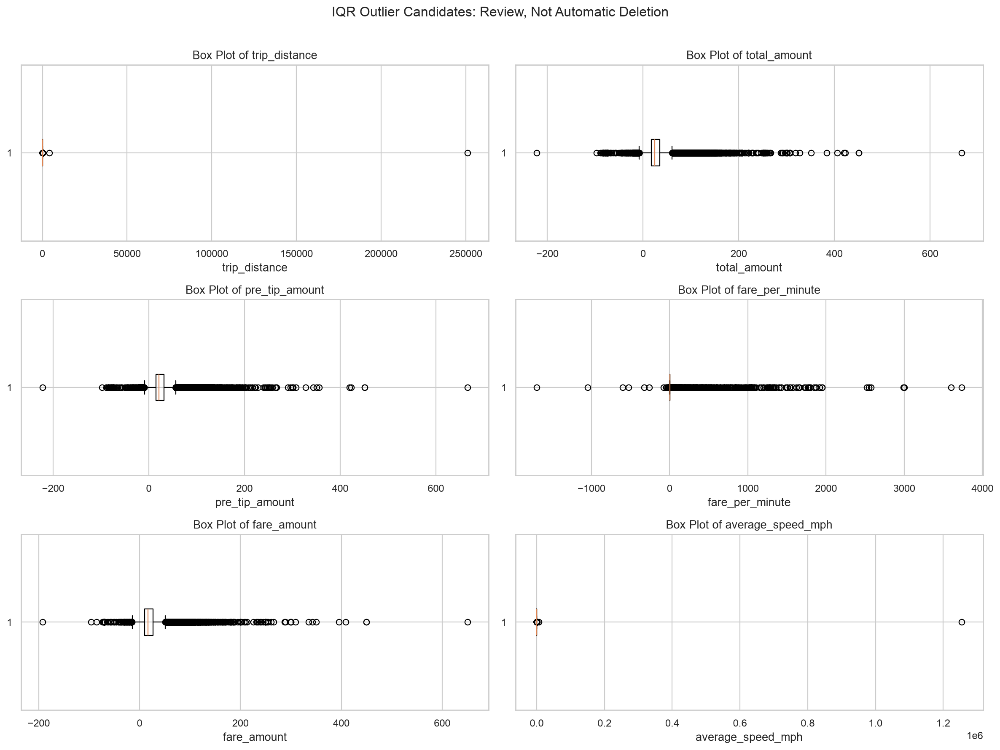

### Possible Action

- 논리 오류: 음수 거리, 하차≤승차 등은 정상 운행 모델 코호트에서 제외합니다.
- 희귀하지만 가능한 값: 원본 유지, 로그 변환·RobustScaler·트리 모델을 검토합니다.
- 변수 조합 오류: 거리와 시간을 이용한 속도, 요금 구성 합과 total_amount 차이로 추가 검증합니다.
- 이상탐지 목적에서는 극단값을 제거하지 말고 핵심 탐지 대상으로 사용합니다.

---

## Question 6. 데이터 품질 플래그는 무엇을 보여주는가?

### Finding

플래그 비율이 높은 항목은 **flag_total_component_mismatch(34.3972), flag_zero_distance(2.7722), flag_invalid_time_order(1.2742), flag_nonpositive_duration(1.2742), flag_negative_total(0.3630)**입니다.
이 플래그는 삭제 목록이 아니라 검토 목록입니다. 하나의 행에 여러 플래그가 동시에 나타날 수 있습니다.

### Evidence

| quality_flag | flagged_count | flagged_rate_percent |
| --- | --- | --- |
| flag_total_component_mismatch | 171986 | 34.3972 |
| flag_zero_distance | 13861 | 2.7722 |
| flag_invalid_time_order | 6371 | 1.2742 |
| flag_nonpositive_duration | 6371 | 1.2742 |
| flag_negative_total | 1815 | 0.3630 |
| flag_negative_fare | 1732 | 0.3464 |
| flag_implausible_speed_review | 99 | 0.0198 |
| flag_negative_tip | 2 | 0.0004 |
| flag_pickup_outside_target_month | 1 | 0.0002 |

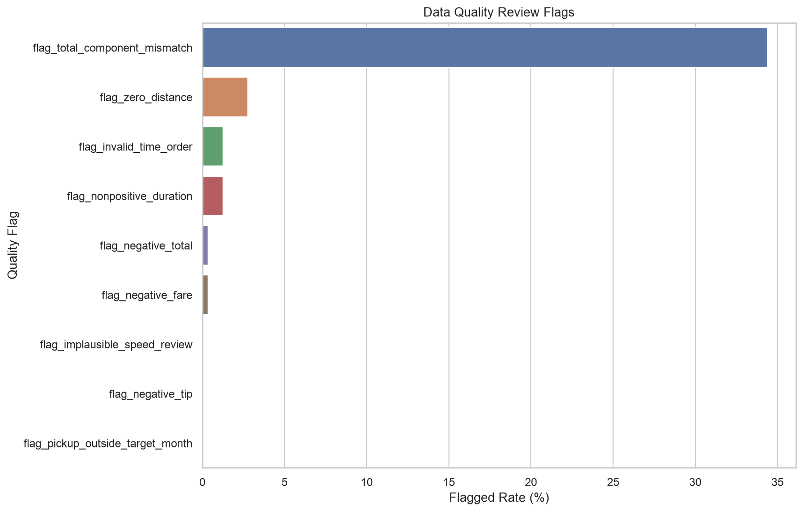

### Possible Action

정상 운행 예측, 이상탐지, 정산 검증 등 분석 목적별로 코호트를 별도로 구성해야 합니다.
예를 들어 음수 요금은 정상 팁 예측에서는 제외할 수 있지만 환불·분쟁 탐지에서는 중요한 데이터입니다.

---

## Question 7. 범주형 변수는 얼마나 다양하고 특정 값에 편중되는가?

### Finding

고유 범주 수가 많은 변수는 **DOLocationID(259), PULocationID(254), pickup_hour(24), PU_Borough(8), DO_Borough(8)**입니다.
LocationID는 CustomerID와 달리 동일 지역 코드가 반복되므로 패턴 학습이 가능합니다. 다만 희소 지역을 모두
독립 One-Hot 컬럼으로 만들면 차원이 커지고 작은 표본의 고팁률이 불안정해질 수 있습니다.

### Evidence

| variable | unique_count_including_missing | top_value | top_count | top_ratio_percent | rare_category_count | rare_row_count | rare_row_rate_percent | recommended_encoding |
| --- | --- | --- | --- | --- | --- | --- | --- | --- |
| DOLocationID | 259 | 236 | 21905 | 4.3810 | 58 | 2189 | 0.4378 | One-Hot 가능하나 희소 범주 통합·빈도 인코딩 검토 |
| PULocationID | 254 | 237 | 24239 | 4.8478 | 92 | 3844 | 0.7688 | One-Hot 가능하나 희소 범주 통합·빈도 인코딩 검토 |
| pickup_hour | 24 | 18 | 34684 | 6.9368 | 0 | 0 | 0.0000 | One-Hot Encoding |
| PU_Borough | 8 | Manhattan | 432428 | 86.4856 | 2 | 108 | 0.0216 | One-Hot Encoding |
| DO_Borough | 8 | Manhattan | 432288 | 86.4576 | 0 | 0 | 0.0000 | One-Hot Encoding |
| RatecodeID | 7 | 1.0 | 347453 | 69.4906 | 0 | 0 | 0.0000 | One-Hot Encoding |
| pickup_dayofweek | 7 | 4 | 83782 | 16.7564 | 0 | 0 | 0.0000 | One-Hot Encoding |
| pickup_day_name | 7 | Friday | 83782 | 16.7564 | 0 | 0 | 0.0000 | One-Hot Encoding |
| payment_type | 5 | 1 | 333504 | 66.7008 | 0 | 0 | 0.0000 | One-Hot Encoding |
| VendorID | 4 | 2 | 394234 | 78.8468 | 0 | 0 | 0.0000 | One-Hot Encoding |
| store_and_fwd_flag | 3 | N | 382972 | 76.5944 | 0 | 0 | 0.0000 | One-Hot Encoding |
| day_type | 2 | Weekday | 344266 | 68.8532 | 0 | 0 | 0.0000 | One-Hot Encoding |
| is_rush_hour | 2 | 0 | 316036 | 63.2072 | 0 | 0 | 0.0000 | One-Hot Encoding |

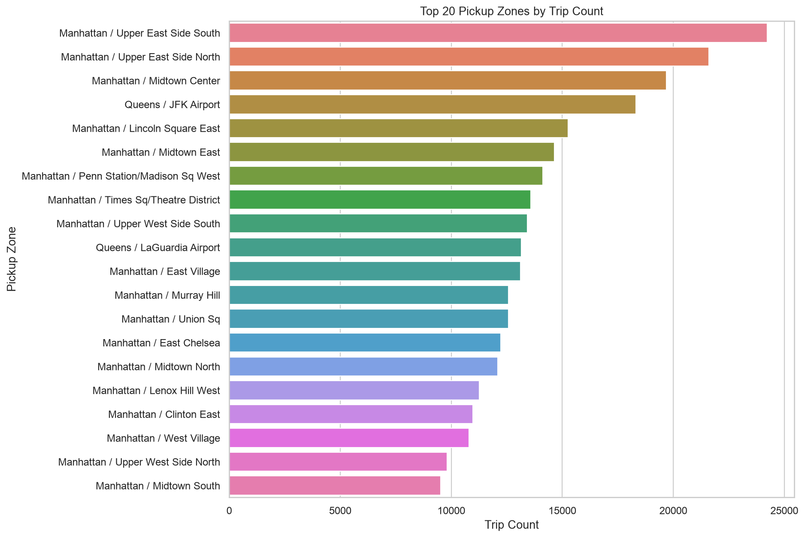

### Possible Action

- 낮은 cardinality: One-Hot Encoding
- 높은 cardinality: 최소 빈도 기준 통합, 빈도 인코딩, 교차검증 기반 Target Encoding 검토
- 범주별 Target 비율은 반드시 표본 수와 함께 해석
- Taxi Zone Lookup을 조인해 Borough·Zone 단위로 의미를 강화

---

## Question 8. 어떤 수치형 변수가 high_tip과 관계가 강한가?

### Finding

절대 상관계수가 큰 변수는 **trip_distance(-0.2035), improvement_surcharge(0.2018), fare_amount(-0.1935), congestion_surcharge(0.1847), airport_fee(-0.1372)**입니다.
상관계수가 낮아도 비선형 관계나 시간·지역과의 상호작용이 존재할 수 있습니다. 상관관계는 인과관계를 의미하지 않습니다.

### Evidence

| variable | valid_count | correlation_with_high_tip | low_tip_mean | high_tip_mean | mean_difference_high_minus_low | cohens_d_high_minus_low |
| --- | --- | --- | --- | --- | --- | --- |
| trip_distance | 333464 | -0.2035 | 4.1919 | 2.3550 | -1.8369 | -0.4200 |
| improvement_surcharge | 333464 | 0.2018 | 0.9097 | 1.0000 | 0.0902 | 0.4165 |
| fare_amount | 333464 | -0.1935 | 23.5348 | 16.3311 | -7.2037 | -0.3985 |
| congestion_surcharge | 333464 | 0.1847 | 2.1211 | 2.4047 | 0.2836 | 0.3798 |
| airport_fee | 333464 | -0.1372 | 0.2198 | 0.0631 | -0.1567 | -0.2800 |
| trip_duration_min | 333464 | -0.1290 | 21.9513 | 14.7109 | -7.2404 | -0.2629 |
| tolls_amount | 333464 | -0.1251 | 0.8532 | 0.2747 | -0.5784 | -0.2549 |
| cbd_congestion_fee | 333464 | 0.0994 | 0.5064 | 0.5745 | 0.0681 | 0.2019 |

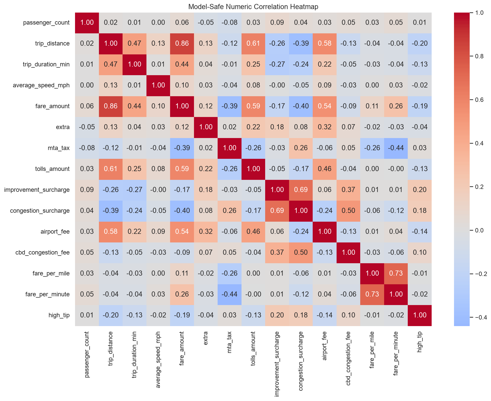

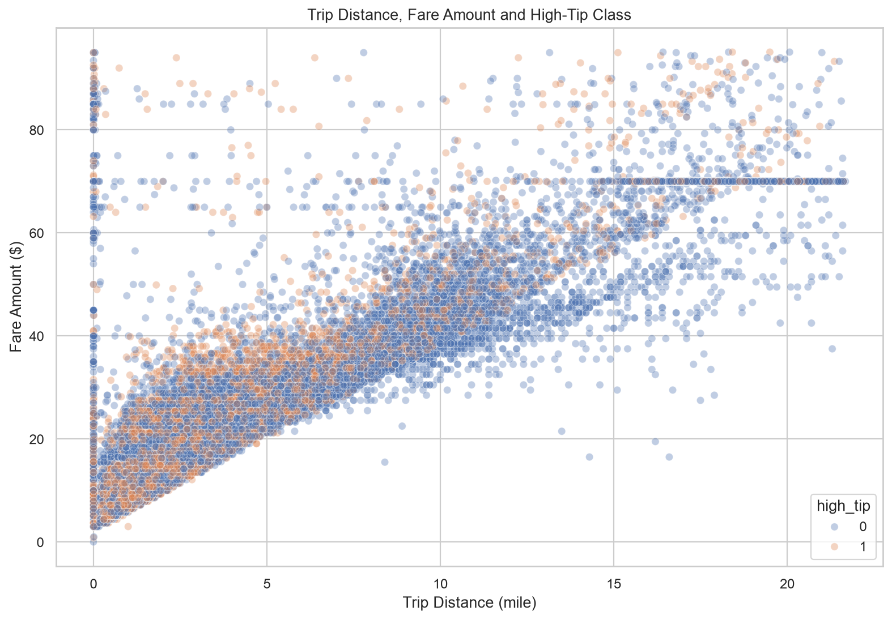

### Possible Action

- 선형 모델은 기본 해석 기준으로 사용합니다.
- 비선형성 확인을 위해 RandomForest·Gradient Boosting 모델을 비교할 수 있습니다.
- 모델 입력 시 `tip_amount`, `total_amount`, `tip_rate`는 Target 누수로 제외합니다.

---

## Question 9. 범주형 변수에 따라 고팁률 차이가 나타나는가?

### Finding

최소 100건 이상인 범주만 비교했습니다. 표본이 매우 작은 범주의 0% 또는 100% 고팁률은
우연에 의한 불안정한 값일 수 있기 때문입니다.

#### 고팁률 상위 범주

| variable | value | count | high_tip_rate_percent | median_tip_rate_pct |
| --- | --- | --- | --- | --- |
| DO_Borough | EWR | 768 | 53.6458 | 20.0000 |
| VendorID | 7 | 5571 | 53.3477 | 20.0000 |
| PU_Borough | Manhattan | 292607 | 46.7955 | 20.0000 |
| RatecodeID | 1.0 | 300497 | 46.3282 | 20.0000 |
| pickup_hour | 2 | 3496 | 45.6522 | 20.0000 |
| DO_Borough | Manhattan | 294911 | 45.5392 | 20.0000 |
| VendorID | 2 | 253476 | 45.0962 | 20.0000 |
| pickup_dayofweek | 5 | 52466 | 44.7738 | 20.0000 |
| pickup_day_name | Saturday | 52466 | 44.7738 | 20.0000 |
| pickup_hour | 3 | 2289 | 44.2988 | 20.0000 |

#### 고팁률 하위 범주

| variable | value | count | high_tip_rate_percent | median_tip_rate_pct |
| --- | --- | --- | --- | --- |
| RatecodeID | 99.0 | 17216 | 0.0000 | 0.0000 |
| PU_Borough | Bronx | 2774 | 1.1536 | 0.0000 |
| PU_Borough | Brooklyn | 7753 | 7.5326 | 0.0000 |
| DO_Borough | Bronx | 3418 | 7.6068 | 0.0000 |
| PU_Borough | Queens | 29607 | 17.1311 | 19.3710 |
| RatecodeID | 2.0 | 9839 | 18.1116 | 19.5226 |
| DO_Borough | Brooklyn | 17509 | 22.2971 | 14.0228 |
| DO_Borough | Queens | 15026 | 22.8537 | 19.3377 |
| RatecodeID | 4.0 | 820 | 25.3659 | 19.5469 |
| DO_Borough |  | 1350 | 27.8519 | 19.3803 |

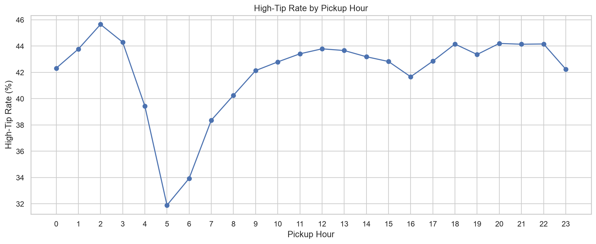

### Possible Action

범주별 차이는 요금 체계, 지역, 시간대가 동시에 작용한 결과일 수 있으므로 단일 범주만으로 원인을 단정하지 않습니다.
모델에서는 여러 변수를 함께 사용하고, 계수 또는 SHAP 등으로 조건부 관계를 확인합니다.

---

## Question 10. 시간대·요일·경로를 함께 보면 어떤 패턴이 나타나는가?

### Finding

- 운행량이 가장 많은 시간: **18.0시**
- 운행량이 가장 많은 요일: **Friday**
- 가장 많이 관찰된 경로: **237_236**

단일 변수만 볼 때보다 시간대×요일, 거리×요금×고팁 클래스, 승차×하차 지역을 함께 보면 운영 패턴과
Target 차이를 더 구체적으로 확인할 수 있습니다.

### Evidence

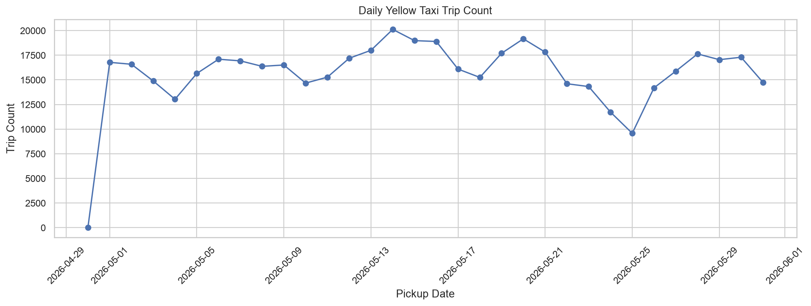

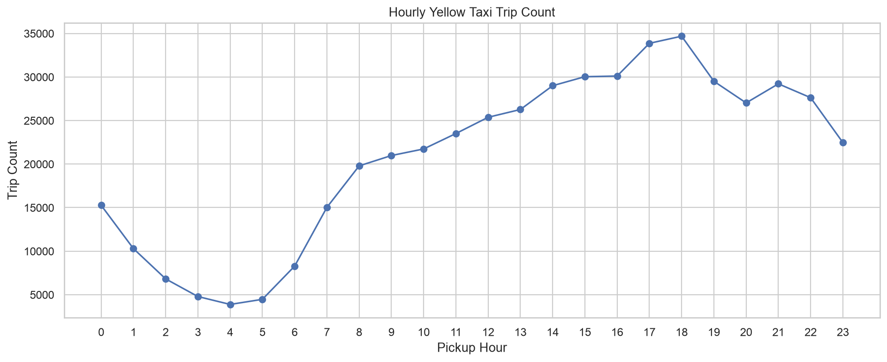

- [요일×시간 운행량 인터랙티브 Heatmap](outputs/interactive/01_hour_day_trip_heatmap.html)
- [거리–요금–고팁 인터랙티브 Scatter](outputs/interactive/02_distance_fare_high_tip_scatter.html)
- [상위 승차 지역 인터랙티브 차트](outputs/interactive/03_top_pickup_zones.html)

### Possible Action

- 향후 여러 달 데이터를 연결할 때 월·계절·공휴일 변수를 추가합니다.
- 동일 월 내부 무작위 분할보다 시간 순서 분할을 사용해 미래 일반화 성능을 확인합니다.
- 경로 단위 표본이 충분할 때 출발·도착 상호작용 특성을 추가합니다.

---

# 통계 분석

## 4. 평일과 주말 카드 팁 비율 Welch t-test

### 가설

- 귀무가설: 평일과 주말의 평균 카드 팁 비율은 같다.
- 대립가설: 평일과 주말의 평균 카드 팁 비율은 다르다.

### 결과

| 항목 | 값 |
| --- | ---: |
| 평일 표본 수 | 150,000 |
| 주말 표본 수 | 96,270 |
| 평일 평균 팁 비율 | 16.8727% |
| 주말 평균 팁 비율 | 17.2170% |
| 평균 차이(평일-주말) | -0.3442%p |
| 평균 차이 95% CI | [-0.4387, -0.2498] |
| t-statistic | -7.1414 |
| p-value | 9.269935e-13 |
| Cohen's d | -0.0301 |
| 효과크기 해석 | 매우 작음 |

**p-value 해석:** p-value가 0.05보다 작으므로 평일과 주말의 평균 카드 팁 비율이 같다는 귀무가설을 기각합니다.

**주의:** 표본이 매우 크면 작은 평균 차이도 유의해질 수 있으므로 p-value뿐 아니라 평균 차이, 신뢰구간, Cohen's d를 함께 해석해야 합니다.

상위 0.5% 극단 팁 비율의 영향을 줄인 민감도 분석 p-value는
**1.552296e-19**, Cohen's d는
**-0.0371**입니다. 원자료와 민감도 분석의 방향이 같은지 확인해
결론이 일부 극단값에만 좌우되는지 판단합니다.

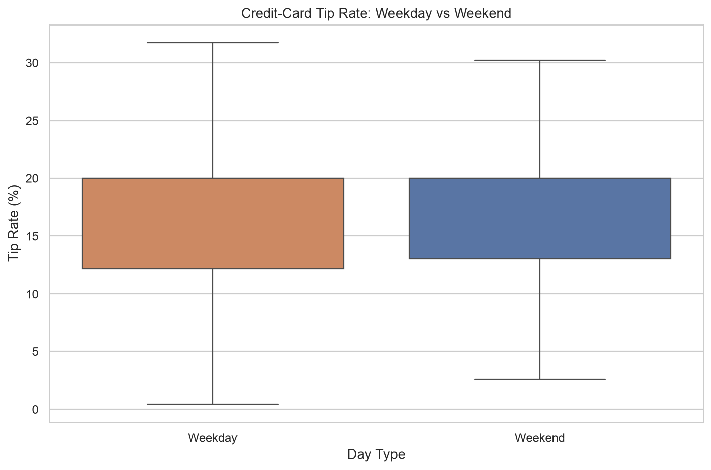

---

# ML Pipeline

## 5. 전처리와 모델 구성

### 수치형 Pipeline

```text
SimpleImputer(strategy='median', add_indicator=True)
→ StandardScaler
```

중앙값은 평균보다 극단값 영향을 덜 받으며, `add_indicator=True`는 원래 결측이었던 행을 별도 신호로 보존합니다.

### 범주형 Pipeline

```text
SimpleImputer(strategy='constant', fill_value='Unknown')
→ OneHotEncoder(handle_unknown='ignore', min_frequency=20)
```

범주 결측을 최빈값으로 채우면 실제 존재하지 않은 Vendor·지역을 만들 수 있으므로 `Unknown`으로 분리합니다.
`handle_unknown='ignore'`는 미래 데이터에 새로운 범주가 등장해도 예측 오류가 나지 않게 합니다.

### 분류 모델

```text
LogisticRegression(class_weight='balanced')
```

로지스틱 회귀는 고팁 확률에 대한 기본선 모델이며 계수를 통해 방향을 해석할 수 있습니다.

### 데이터 누수 방지

다음 컬럼은 목표값 생성에 직접 또는 강하게 연결되므로 모델 입력에서 제외했습니다.

```text
calculated_total_from_components, high_tip, payment_type, pre_tip_amount, quality_flag_count, tip_amount, tip_rate, tip_rate_pct, total_amount, total_component_gap
```

카드 결제만 사용하므로 `payment_type`은 모두 1인 상수이며 정보력이 없어 제외했습니다.

---

## 6. 학습·평가 분할

| split_method | train_rows | test_rows | train_start | train_end | test_start | test_end | reason |
| --- | --- | --- | --- | --- | --- | --- | --- |
| time_ordered_holdout | 160000 | 40000 | 2026-05-01 00:00:09 | 2026-05-25 14:17:29 | 2026-05-25 14:17:34 | 2026-05-31 23:59:57 | 과거 운행으로 학습하고 이후 운행을 평가하여 실제 미래 예측 상황에 가깝게 구성 |

시간 분할을 우선 사용하여 과거 운행으로 학습하고 이후 운행을 평가했습니다. 시간 분할에서 한 클래스가 사라지면
층화 무작위 분할로 자동 전환합니다.

---

## 7. 모델 평가 결과

| 지표 | 값 |
| --- | ---: |
| Baseline Accuracy | 0.5764 |
| Accuracy | 0.5664 |
| Balanced Accuracy | 0.6035 |
| Precision | 0.4931 |
| Recall | 0.8470 |
| F1-score | 0.6233 |
| ROC-AUC | 0.6507 |
| Average Precision | 0.5334 |
| 학습 시간 | 3.34초 |

```text
              precision    recall  f1-score   support

   Below 20%     0.7620    0.3601    0.4891     23056
 20% or more     0.4931    0.8470    0.6233     16944

    accuracy                         0.5664     40000
   macro avg     0.6276    0.6035    0.5562     40000
weighted avg     0.6481    0.5664    0.5460     40000

```

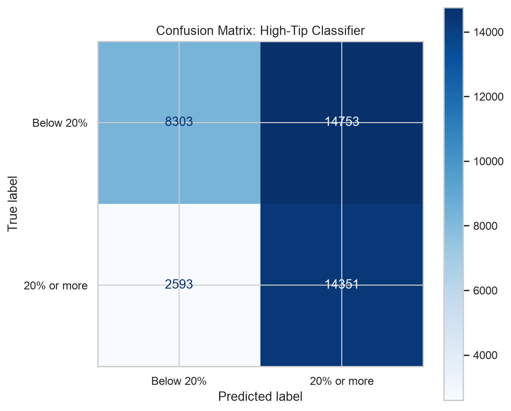

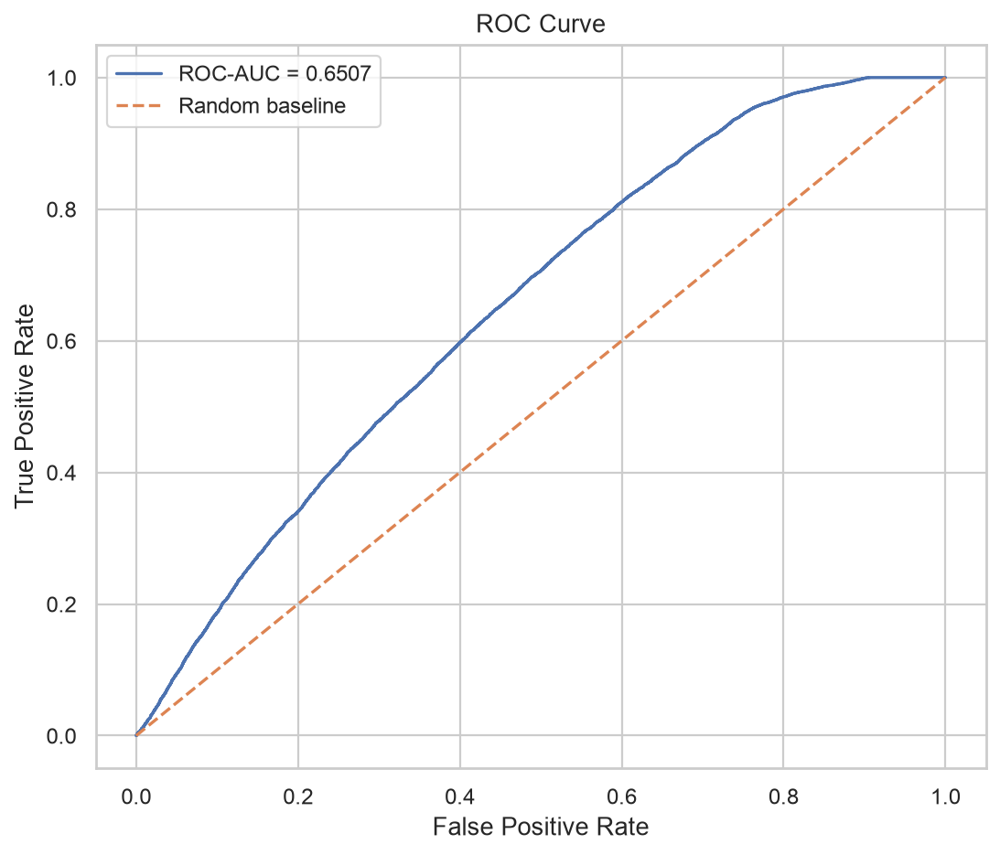

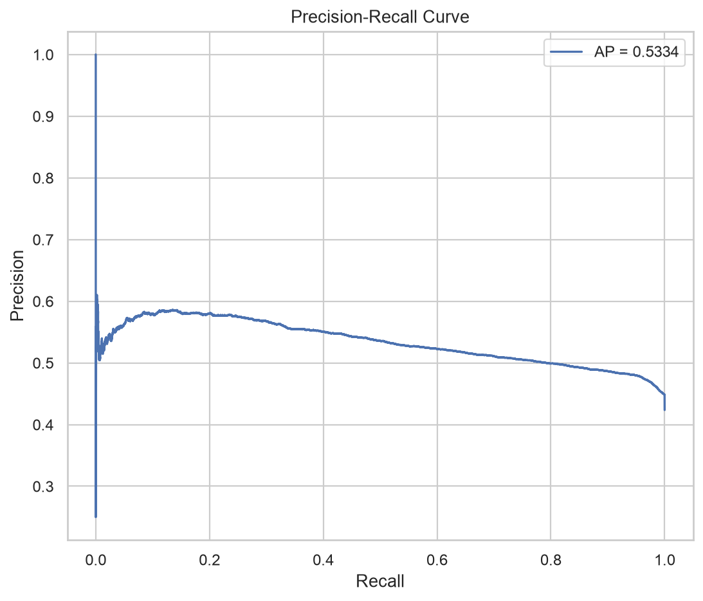

### 평가 해석 기준

- Accuracy가 Baseline보다 높은지 확인합니다.
- 클래스 불균형 때문에 Accuracy만 보지 않고 Balanced Accuracy와 F1을 함께 봅니다.
- Recall은 실제 고팁 운행을 얼마나 찾았는지, Precision은 고팁 예측 중 실제 고팁 비율을 나타냅니다.
- ROC-AUC와 Average Precision은 임계값 0.5 하나에만 의존하지 않는 순위 성능을 보여줍니다.

---

## 8. 로지스틱 회귀 계수 해석

계수는 다른 변수가 같다는 조건에서 고팁 로그오즈가 증가·감소하는 방향을 나타냅니다. 범주 빈도, 스케일링,
다중공선성 영향을 받으므로 인과관계로 해석하면 안 됩니다.

### 고팁 확률 증가 방향 상위 변수

| transformed_feature | coefficient | absolute_coefficient | direction |
| --- | --- | --- | --- |
| numeric__improvement_surcharge | 1.7205 | 1.7205 | 고팁 확률 증가 방향 |
| categorical__PULocationID_83 | 1.3023 | 1.3023 | 고팁 확률 증가 방향 |
| categorical__PULocationID_260 | 1.1058 | 1.1058 | 고팁 확률 증가 방향 |
| categorical__PULocationID_155 | 1.0316 | 1.0316 | 고팁 확률 증가 방향 |
| categorical__DOLocationID_1 | 1.0212 | 1.0212 | 고팁 확률 증가 방향 |
| categorical__DO_Borough_EWR | 1.0212 | 1.0212 | 고팁 확률 증가 방향 |
| categorical__DOLocationID_241 | 0.9815 | 0.9815 | 고팁 확률 증가 방향 |
| categorical__DO_Borough_Staten Island | 0.9055 | 0.9055 | 고팁 확률 증가 방향 |
| categorical__PULocationID_235 | 0.8573 | 0.8573 | 고팁 확률 증가 방향 |
| categorical__DOLocationID_198 | 0.8418 | 0.8418 | 고팁 확률 증가 방향 |
| categorical__DOLocationID_265 | 0.8375 | 0.8375 | 고팁 확률 증가 방향 |
| categorical__DOLocationID_190 | 0.8157 | 0.8157 | 고팁 확률 증가 방향 |
| categorical__PULocationID_49 | 0.8095 | 0.8095 | 고팁 확률 증가 방향 |
| categorical__DOLocationID_86 | 0.8044 | 0.8044 | 고팁 확률 증가 방향 |
| categorical__DOLocationID_70 | 0.7581 | 0.7581 | 고팁 확률 증가 방향 |

### 고팁 확률 감소 방향 상위 변수

| transformed_feature | coefficient | absolute_coefficient | direction |
| --- | --- | --- | --- |
| categorical__RatecodeID_99.0 | -1.5710 | 1.5710 | 고팁 확률 감소 방향 |
| categorical__PU_Borough_EWR | -1.1044 | 1.1044 | 고팁 확률 감소 방향 |
| categorical__PULocationID_1 | -1.1044 | 1.1044 | 고팁 확률 감소 방향 |
| categorical__DOLocationID_28 | -0.9908 | 0.9908 | 고팁 확률 감소 방향 |
| categorical__DOLocationID_250 | -0.9433 | 0.9433 | 고팁 확률 감소 방향 |
| categorical__DOLocationID_76 | -0.9248 | 0.9248 | 고팁 확률 감소 방향 |
| categorical__DOLocationID_39 | -0.9184 | 0.9184 | 고팁 확률 감소 방향 |
| categorical__DOLocationID_121 | -0.9166 | 0.9166 | 고팁 확률 감소 방향 |
| categorical__DOLocationID_168 | -0.9131 | 0.9131 | 고팁 확률 감소 방향 |
| categorical__DOLocationID_220 | -0.8540 | 0.8540 | 고팁 확률 감소 방향 |
| categorical__DOLocationID_264 | -0.8281 | 0.8281 | 고팁 확률 감소 방향 |
| categorical__DOLocationID_126 | -0.8227 | 0.8227 | 고팁 확률 감소 방향 |
| categorical__PULocationID_56 | -0.7803 | 0.7803 | 고팁 확률 감소 방향 |
| categorical__DOLocationID_177 | -0.7775 | 0.7775 | 고팁 확률 감소 방향 |
| categorical__DOLocationID_213 | -0.7762 | 0.7762 | 고팁 확률 감소 방향 |

---

# 종합 결론

## 9. 주요 Finding

1. Yellow Taxi 데이터는 날짜·거리·요금·코드형 범주가 섞여 있어 dtype만으로 전처리를 결정하면 안 됩니다.
2. 결측은 단순 누락뿐 아니라 Vendor·수집 방식 차이일 수 있으므로 결측 여부 자체를 모델 신호로 보존했습니다.
3. 거리·시간·요금의 큰 값은 실제 희귀 운행일 수 있어 자동 삭제하지 않고 IQR·속도·요금 합계 플래그로 검토했습니다.
4. 현금 팁은 기록되지 않으므로 팁 분석과 high_tip 모델은 카드 결제만 사용했습니다.
5. Target 생성 컬럼을 입력에서 제외하고 시간 분할을 우선 적용해 데이터 누수와 비현실적 평가를 줄였습니다.
6. 모델 평가는 Accuracy뿐 아니라 F1, Balanced Accuracy, ROC-AUC, Average Precision으로 다면 평가했습니다.

## 10. 개선 방향

- 한 달이 아닌 여러 달을 사용해 계절성과 월별 분포 변화를 검증합니다.
- 공휴일·날씨·이벤트·공항·Borough 정보와 결합합니다.
- 로지스틱 회귀와 RandomForest·Gradient Boosting 성능을 비교합니다.
- 확률 Calibration과 서비스 비용에 따른 최적 임계값을 선택합니다.
- PSI·결측률·범주 변화·성능 저하를 모니터링하는 AIOps 단계를 추가합니다.
- 이상탐지가 목적이라면 현재 품질 플래그와 극단값을 삭제하지 않고 별도 탐지 모델의 입력으로 사용합니다.

---

## 11. 생성 파일

### 정적 차트

- `outputs/figures/01_missing_rate_by_column.png`
- `outputs/figures/02_quality_flag_rates.png`
- `outputs/figures/03_tip_rate_distribution.png`
- `outputs/figures/04_numeric_feature_distributions.png`
- `outputs/figures/05_iqr_candidate_boxplots.png`
- `outputs/figures/06_model_safe_correlation_heatmap.png`
- `outputs/figures/07_daily_trip_count.png`
- `outputs/figures/08_hourly_trip_count.png`
- `outputs/figures/09_tip_rate_weekday_weekend.png`
- `outputs/figures/10_distance_fare_high_tip.png`
- `outputs/figures/11_high_tip_rate_by_hour.png`
- `outputs/figures/12_top_pickup_zones.png`
- `outputs/figures/13_model_confusion_matrix.png`
- `outputs/figures/14_model_roc_curve.png`
- `outputs/figures/15_model_precision_recall_curve.png`

### 인터랙티브 차트

- `outputs/interactive/01_hour_day_trip_heatmap.html`
- `outputs/interactive/02_distance_fare_high_tip_scatter.html`
- `outputs/interactive/03_top_pickup_zones.html`

### 모델

- `outputs/models/yellow_taxi_high_tip_pipeline.joblib`

### 주요 표

- `outputs/tables/column_ml_profile.csv`
- `outputs/tables/missing_summary_analysis_sample.csv`
- `outputs/tables/iqr_outlier_candidate_summary.csv`
- `outputs/tables/quality_flag_summary.csv`
- `outputs/tables/numeric_distribution_summary.csv`
- `outputs/tables/categorical_cardinality_summary.csv`
- `outputs/tables/numeric_target_relationships.csv`
- `outputs/tables/categorical_target_relationships.csv`
- `outputs/tables/ttest_weekday_weekend_tip_rate.json`
- `outputs/tables/model_metrics.json`
- `outputs/tables/model_logistic_coefficients.csv`

## 12. 분석 한계

- 후속 EDA가 표본 설정일 경우 희귀 운행과 희소 범주의 비율이 전체와 조금 다를 수 있습니다.
- Taxi 기록은 기술 제공업체가 수집한 자료이므로 극단값이 실제 운행인지 입력 오류인지 원본만으로 확정할 수 없습니다.
- 본 모델은 인과 추론 모델이 아니라 고팁 여부의 예측 패턴을 찾는 분류 모델입니다.
- high_tip 20% 기준은 프로젝트 정의이므로 실제 서비스에서는 비즈니스 목적에 맞춰 재설정해야 합니다.
